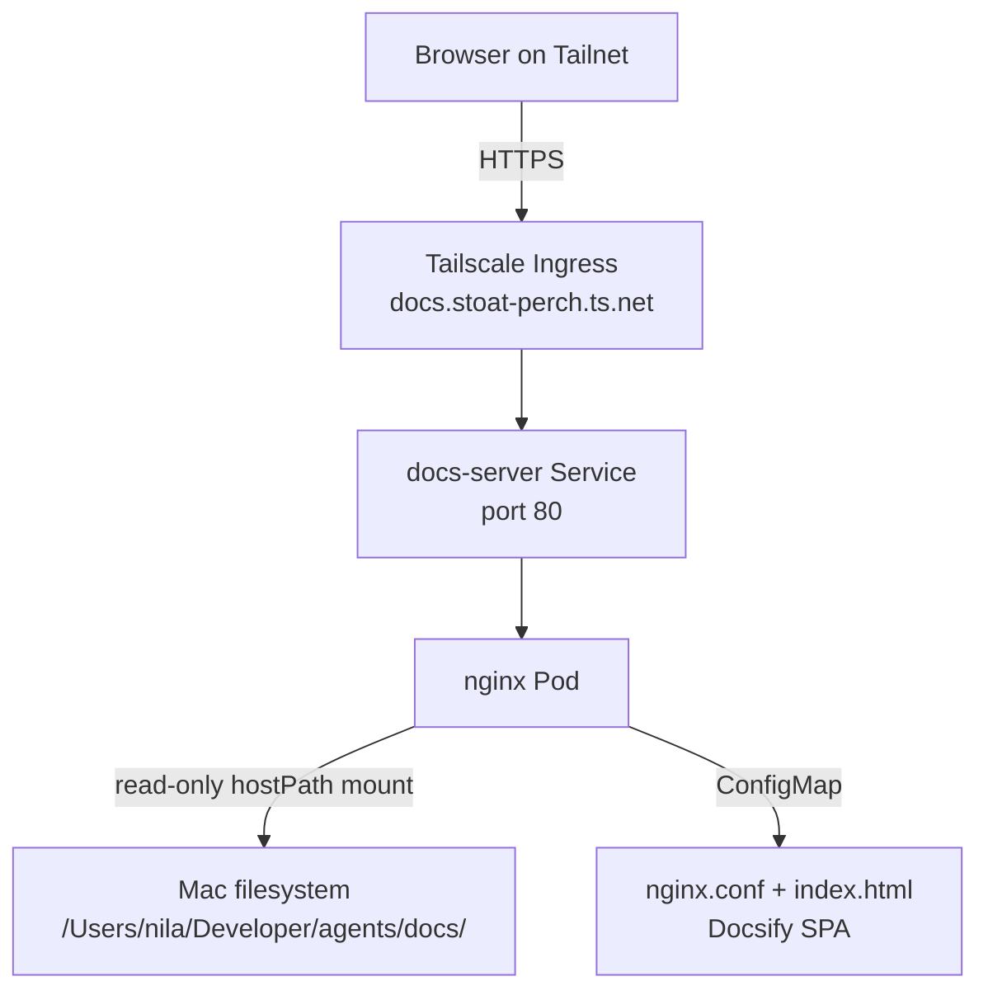

# Docs site — Architecture & Tech Stack

**On this page:** [Deployment diagram](#deployment-diagram) · [What is it](#what-is-it) · [Tech stack](#tech-stack) · [Current content architecture](#current-content-architecture) · [Source code](#source-code) · [Design decisions](#design-decisions) · [How content gets to the site](#how-content-gets-to-the-site) · [Why this serves multi-app docs](#why-this-serves-multi-app-docs) · [Future: migration to git-sync](#future-migration-to-git-sync) · [Reference](#reference)

## Deployment diagram



## What is it

A tiny static-file server that renders the homelab markdown docs as a browsable web site via Docsify (client-side JS).

## Tech stack

| Layer | Tech | Why |
|---|---|---|
| Web server | nginx (alpine image, ~25MB) | Tiny, fast, only serves static files |
| Renderer | [Docsify](https://docsify.js.org) v4 | No build step — renders markdown in the browser |
| Search | Docsify search plugin | Client-side full-text search |
| Code highlight | Prism.js (bash, yaml, json) | Inline in pages |
| Content source | hostPath PV → `$DOCS_HOST_PATH` | Live mount — edit on Mac, see instantly |
| Config | nginx.conf + index.html in ConfigMap | All declarative |
| Ingress | Tailscale Ingress (HTTPS) | https://docs.stoat-perch.ts.net |
| Cluster | k3s in OrbStack |  |

## Current content architecture

The pod mounts `$DOCS_HOST_PATH` (default: `/Users/nila/Developer/agents/docs/`) as a read-only hostPath PV. All homelab app docs live under that single directory:

```
$DOCS_HOST_PATH/                                     ← hostPath mount on Mac filesystem
├── README.md
├── _sidebar.md                                      ← top-level nav
├── chores/                                          ← chores app docs
├── homelab-k8s-setup/
│   ├── apps/...
│   ├── configs/...
│   └── _sidebar.md                                  ← per-folder nav (override)
└── ...

Mounted in pod at: /usr/share/nginx/html/docs/
Plus index.html mounted at: /usr/share/nginx/html/index.html (from ConfigMap)
```

**Important:** the docs files at `$DOCS_HOST_PATH` are the authoritative source for what the pod serves. The `docs/` folder in this repo is a copy for reference/portability only — it does NOT feed the running pod.

## Source code

**Zero custom code** — entirely Docker image + nginx config + Docsify CDN.

| | |
|---|---|
| nginx | https://hub.docker.com/_/nginx |
| Docsify | https://github.com/docsifyjs/docsify |

## Design decisions

- **nginx static + Docsify** vs Hugo/Jekyll/MkDocs — no build step. Edit `.md` on the Mac, refresh page, done. For a personal homelab, build-step overhead isn't justified.
- **Read-only PV** — docs site can't accidentally modify your source files even if compromised (`readOnly: true` on the mount).
- **Service worker caching** — Docsify caches markdown aggressively for offline reading. Caveat: edits may need hard refresh to appear.
- **Hash routing** (`/#/path/file`) — Docsify uses URL fragments for routing. Direct `/docs/path/file.md` URLs work too, just serve raw markdown.
- **`relativePath: true`** — required so in-content relative links in sub-folder READMEs resolve correctly. Without it, bare relative links (e.g. `[Maintenance](MAINTENANCE.md)`) resolve from the docs root and 404.

## How content gets to the site

1. Edit any `.md` file under `$DOCS_HOST_PATH` on the Mac.
2. OS filesystem hosts the change.
3. OrbStack VM sees the change instantly (virtiofs/9p passthrough).
4. Pod's nginx serves the new file on next request.
5. Browser fetches → Docsify renders.

No build. No deploy. No restart.

## Why this serves multi-app docs

The PV mounts the parent docs folder (not just one app's subfolder). So one docs site serves docs for:
- Chores app (`chores/`)
- Homelab cluster (`homelab-k8s-setup/`)
- Any future top-level docs folders

The global `_sidebar.md` at the parent provides cross-app navigation. Per-folder sidebars can override for app-specific contexts (Docsify auto-discovers `_sidebar.md` at the current path).

## Future: migration to git-sync

See [MIGRATION-TO-GIT-SYNC](MIGRATION-TO-GIT-SYNC.md) for the planned evolution away from hostPath.

## Reference

- Docsify docs: https://docsify.js.org
- Docsify plugins: https://docsify.js.org/#/plugins
- nginx config docs: https://nginx.org/en/docs/
